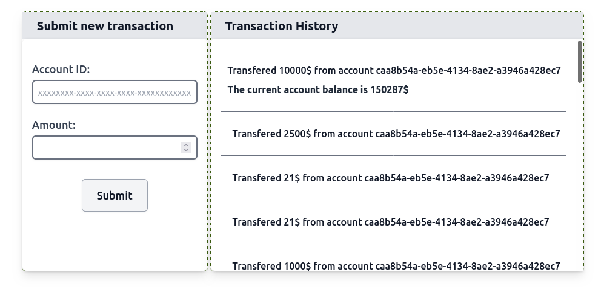

# Transaction Management Frontend 

A frontend app that allows the recording of financial transactions and viewing the transaction history by connecting to a hosted Transaction Management API.

Built using the React Framework.

### Frontend requirements

The transaction list displays the withdrawn or deposited amount for each transaction, along with the affected account ID. It also renders the current balance for the last submitted transaction.

### SCREENSHOT



Here's the UI mockup with hints:


Feel free to tweak the UI, but please ensure that the following HTML is in place.

#### The form for submitting transactions

```html
<form ... >
  <input data-type="account-id" ... />
  <input data-type="amount" ... />
  <input data-type="transaction-submit" type="submit" ... />
</form>
```

Both input **fields should be cleared** after the form is submitted.

#### Transactions list

Every newly submitted transaction should go on **the top of the list** and should have an enclosing `<div />` with the following structure:

```html
<div 
  data-type="transaction"
  data-account-id="${transaction-account-id}"
  data-amount="${transaction-amount}"
  data-balance="${current-account-balance}" ...>
  ...
</div>
```

- `${transaction-account-id}` - account id of the corresponding transaction.
- `${transaction-amount}` - transaction amount.
- `${current-account-balance}` - the current account balance right after submitting the transaction (only show for the last submitted transaction).

### The API to integrate with

<details>
<summary>Untoggle to see request examples</summary>

##### Get historical transactions

```
GET https://infra.devskills.app/api/accounting/transactions
```

##### Create a new transaction

```
POST https://infra.devskills.app/api/accounting/transaction
Content-Type: application/json

{
  "account_id": "0afd02d3-6c59-46e7-b7bc-893c5e0b7ac2",
  "amount": 7
}
```

##### Get a transaction by id

```
GET https://infra.devskills.app/api/accounting/transactions/7c94635a-40a3-4c87-888a-42c3ce5b9750
```

##### Get an account by id
```
GET https://infra.devskills.app/api/accounting/accounts/0afd02d3-6c59-46e7-b7bc-893c5e0b7ac2
```

</details>

## Additional requirements

- Tests [provided E2E tests](cypress/e2e/test.cy.js) pass.
- Implemented client-side validation of the form data.
- Implemented error handling for the cases when the API cannot be reached or returns a server error.
- Avoids duplication and extract re-usable modules where it makes sense. Creates a codebase that is easy to maintain.

## Getting started

<details>

<details>
  <summary>Import a starter project</summary>

  We have created a set of starter projects with different tech stacks to help you get started quickly.

  To import a starter project:
  
  1. Go to the "Actions" tab of your GitHub repository and select the "Setup boilerplate" workflow in the left side panel.
  2. In the "Run workflow" dropdown, select the desired boilerplate along with the branch name where you want the boilerplate to be imported (e.g., `implementation`) and click the "Run workflow" button (you can find all starter projects' definitions [here](https://help.alvalabs.io/en/articles/7972852-supported-coding-test-boilerplates)).
  
  After the workflow has finished, your selected boilerplate will be imported to the specified branch, and you can continue from there.
  
  
  > ⚠️ **Custom setup**
  > 
  > If you instead want to set up a custom project, complete the steps below to make the E2E tests run correctly:
  > 1. Update the `baseUrl` (where your frontend runs) in [cypress.config.js](cypress.config.js).
  > 2. Update the `apiUrl` (where your backend runs) in [cypress.config.js](cypress.config.js).
  > 3. Update the [`build`](package.json#L5) and [`start`](package.json#L6) scripts in [package.json](package.json) to respectively build and start your app.
  
</details>

<details>
  <summary>Prepare for coding</summary>

  To get this repository to your local machine, clone it with `git clone`.

  Alternatively, spin up a pre-configured in-browser IDE by clicking on the "Code" tab in this repository and then "Create codespace on {branch_name}".
  
  

</details>

<details>
  <summary>Running the E2E tests</summary>

  > ⚠️ Before executing the tests, ensure [Node](https://nodejs.org/en) is installed and your app is running.

  ```bash
  npm install
  npm run test
  ```

</details>
